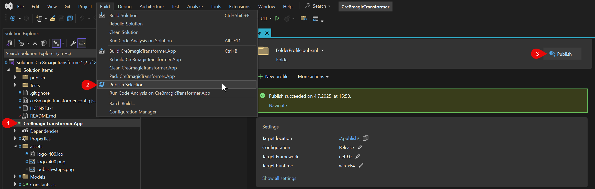

# cre8magic ♾️ Transformer

> Oqtane Template / Module generator
> and Template to Theme / Module converter

This is a template generator for Oqtane, designed to help you create new templates quickly and easily.

It is meant to convert existing Oqtane Themes (and possibly Modules) into Oqtane Templates.

You can also use it to reverse the process, converting Oqtane Templates back into Themes or Modules.

See [docs](https://cre8magic.blazor-cms.org/magic-tools/cre8magic-transformer/)

---

## Before publishing new version

1. Bump version in `Cre8magicTransformer.App.csproj` project file.
1. Change build configuration to `Release`.

## How to Publish a Self-Contained `cre8magicTransformer.exe` inside Visual Studio

Below is a visual guide and step-by-step instructions to publish the app as a self-contained executable:

To generate a self-contained `cre8magicTransformer.exe`, follow these steps inside Visual Studio:

1. **Select the project**
   In Solution Explorer, click on the `Cre8magicTransformer.App` project.

1. **Publish Selection**
   From the top menu, go to **Build > Publish Selection** for EXE publishing.

1. **Publish the App**
   Click the big **Publish** button on right side. Ensure your settings are:

   * Configuration: `Release`
   * Target Framework: `net9.0`
   * Target Runtime: `win-x64`
   * Deployment Mode: `Self-contained`

Once published, the output folder (in repo root `\publish\`) will contain `cre8magicTransformer.exe`.

You can now run it directly without requiring .NET to be pre-installed.

## 🔧 How to Publish as a Self-Contained EXE from Terminal

1. **Open a terminal** in the project root directory (where `Cre8magicTransformer.App.csproj` is located).

   `cd Cre8magicTransformer.App`

1. **Run the following command:**

   `dotnet publish`   This uses the settings in the project file to produce a self-contained, single-file executable for Windows x64.

1. **Find the output:**

   * The published files will be in the `publish` folder (as set in the project file) in root solution folder.
   * Look for `cre8magicTransformer.exe` in `/publish/`.

1. **Run the app:**

   * Run `cre8magicTransformer.exe` from the command line.

> The executable is self-contained: it does not require .NET to be executed on the target machine.
